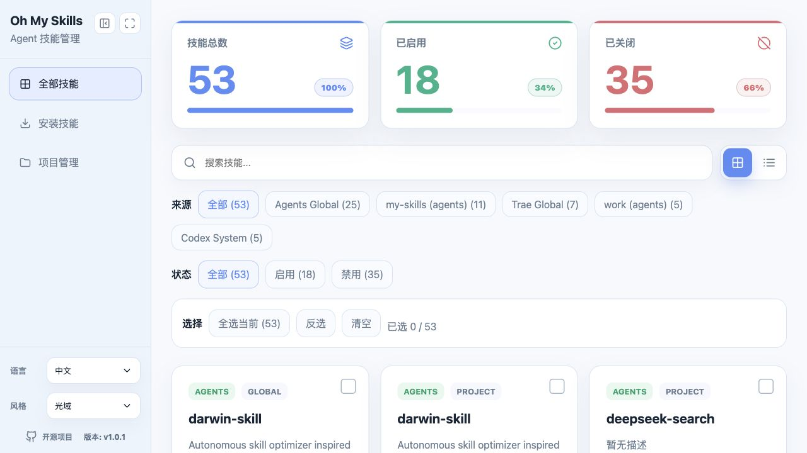
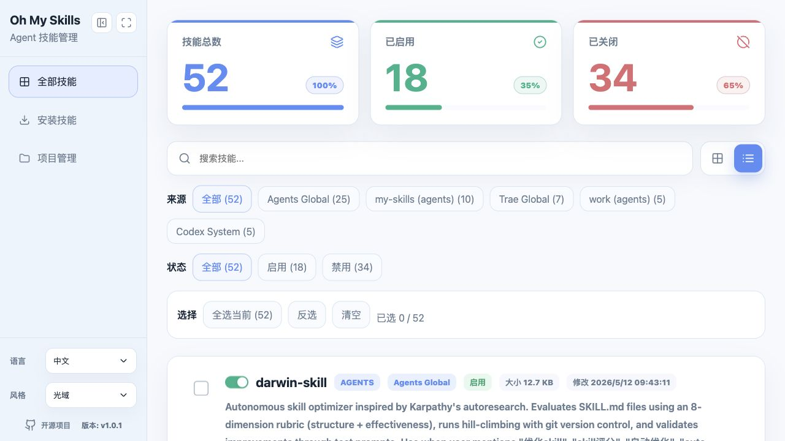
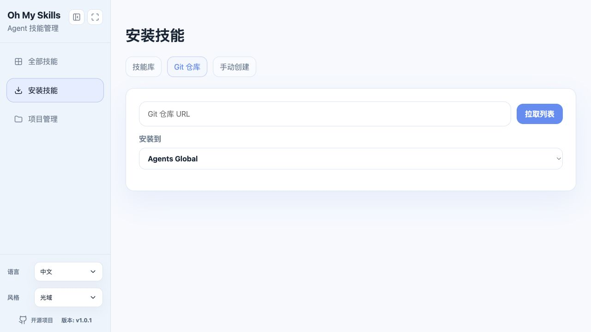
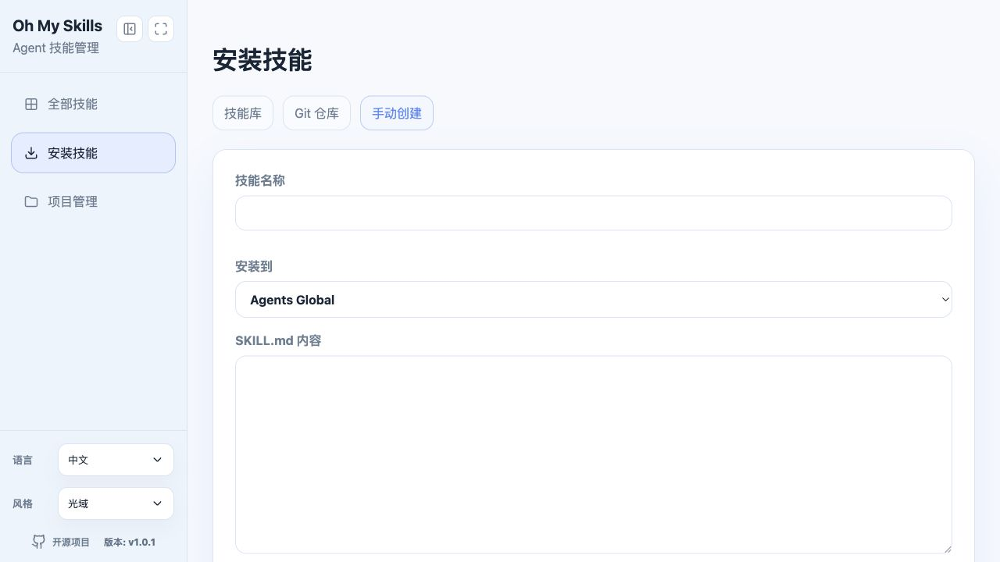
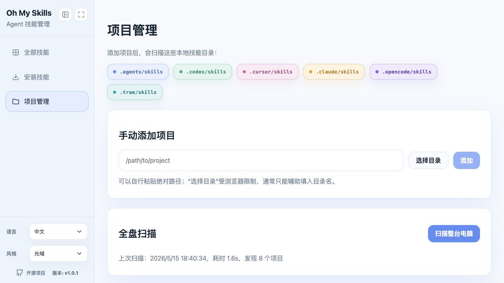
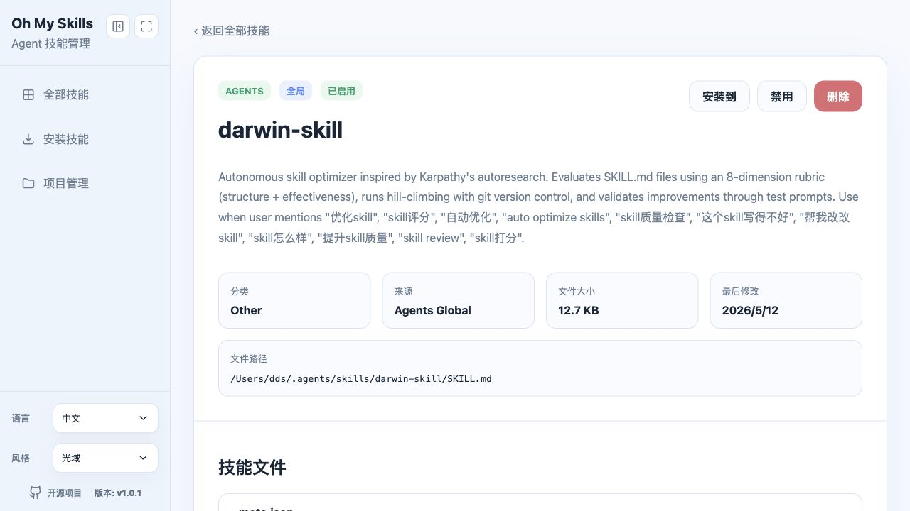
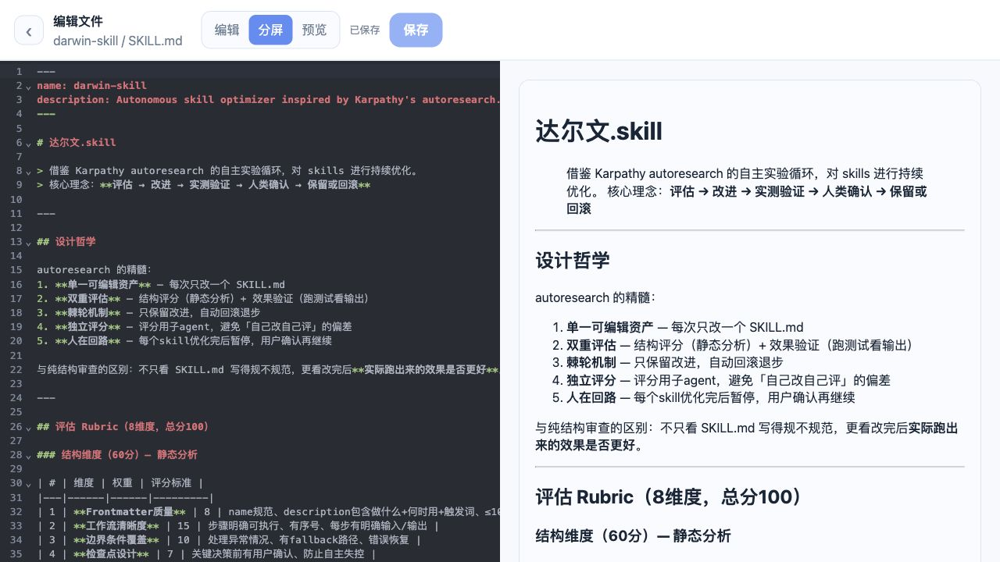

# Oh My Skills

[中文](./README.md) | English

Oh My Skills is a local AI Agent skill management dashboard. It helps you discover, inspect, edit, install, copy, enable, disable, and delete skills across tools such as Agents, Codex, Claude, Cursor, OpenCode, and Trae. The goal is to bring scattered `SKILL.md` files and rule folders into one visual workspace.

Recommended global install:

```bash
npm i -g oh-my-skills
oms
oms --help
oh-my-skills --help
```

By default, the CLI tries port `2525` first. `oms` is the short alias for `oh-my-skills`.

## Product Tour

### Skill Dashboard

View global and project skills in one place. The summary cards follow source and search filters, while the list supports search, source filters, state filters, multi-select, and bulk operations. The dashboard includes both card and list browsing modes.





### Install Skills

The install page supports SkillHub search. It shows popular skills on entry while keeping the search field empty; enter a keyword and press Enter or click Search. Results show author, source, downloads, stars, and local install state.


You can also install from a Git repository or manually create a new `SKILL.md`.





### Project Management

Scan the whole machine for projects that contain skill folders, or manually add project paths so project-level skills appear in the dashboard.



### Skill Details and File Editing

The detail page shows state, source, path, file size, last modified time, and every file under the skill folder. Editable files open in a dedicated editor with edit, split, and preview modes. The editor follows the selected theme and keeps editing controls on the left for faster repeated work.





## Core Features

### Unified Skill List

- Automatically scans common global skill folders on your machine.
- Shows skill name, description, source, tool type, enabled state, file size, and last modified time.
- Supports keyword search.
- Supports source filtering with per-source counts.
- Supports status filtering: all, enabled, disabled.
- Opens the skill detail page by clicking the title or description.

### Multi-Tool Directory Support

Supported global folders include:

- `~/.agents/skills`
- `~/.codex/skills`
- `~/.codex/skills/.system`
- `~/.cursor/skills`
- `~/.claude/skills`
- `~/.opencode/skills`
- `~/.trae/skills`
- `~/.windsurf/rules`
- `~/.cline/rules`
- `~/.continue/rules`
- `~/.roo/rules`

Supported project-level folders:

- `.agents/skills`
- `.codex/skills`
- `.cursor/skills`
- `.claude/skills`
- `.opencode/skills`
- `.trae/skills`

`~/.claude/plugins` is not scanned by default because it usually contains too many entries and creates noisy results.

### Skill Details and File Management

- View skill metadata, source, category, path, size, and last modified time.
- View every file under a skill folder.
- Supports nested directory file lists.
- Edit common text files such as `md`, `json`, `yaml`, `toml`, `js`, `ts`, `py`, and `sh`.
- File editor supports edit, split, and preview modes.
- Markdown files can be previewed.
- Save actions provide clear feedback.

### Enable, Disable, and Delete

- Enable or disable a skill from the list or detail page.
- Enabled state stays synchronized across views.
- Delete actions require confirmation.
- The list is rescanned after deletion.

### Bulk Actions

Select multiple skills and run batch operations:

- Select all visible results.
- Invert current selection.
- Clear selection.
- Install selected skills to a destination.
- Enable selected skills.
- Disable selected skills.
- Delete selected skills.

### SkillHub Installation

- The install page starts with an empty search field; enter a keyword and press Enter or click Search to query SkillHub.
- Search community skills from SkillHub.
- Results show author, source, downloads, and stars.
- If a matching local skill already exists, the result is marked as installed.
- Reinstalling an already installed skill is blocked with a message asking the user to manually delete the original skill first.
- Install destination can be selected from global folders such as Agents, Cursor, Claude, OpenCode, Trae, and Codex.

### Git Repository Installation

- Enter a Git repository URL.
- The app clones the repository and detects skill folders containing `SKILL.md`.
- Choose a detected skill and install it to a destination folder.

### Manual Creation

- Enter a skill name.
- Write the `SKILL.md` content directly.
- Choose a destination and create a new local skill.

### Project Management

- Add project paths manually.
- Scan the whole computer for projects containing known skill folders.
- Show the last scan time, duration, and number of discovered projects.
- Add discovered projects to the tracked list.
- Once tracked, project-level skills appear in the main skill list.

### Interface Features

- Icon-based sidebar navigation.
- Collapsible sidebar.
- Fullscreen toggle.
- Chinese and English language switch.
- Default language follows the user's system/browser language: Chinese environments use Chinese, all other languages use English.
- Manual language choice is persisted.
- Multiple skins: Luma, Paper, Graphite, and Celadon.

## Installation and Usage

Run the latest version without installing:

```bash
npx oh-my-skills@latest
```

Install globally:

```bash
npm install -g oh-my-skills
oh-my-skills
```

Alias:

```bash
oms
```

To use a custom port:

```bash
oh-my-skills --port 2526
```

Then open:

```text
http://localhost:2525
```

The default port is `2525`. If no explicit `--port` is provided and `2525` is already in use, the CLI automatically tries the next available port starting from `2526`. If you pass `--port`, that exact port is used.

## CLI and Agent Usage

Oh My Skills is not only a web dashboard. It also provides a full CLI. The same core API capabilities can be called with `oh-my-skills` or the short alias `oms`, so agents can automate skill installation, scanning, enabling, disabling, deleting, and project management from the terminal.

Recommended global install:

```bash
npm i -g oh-my-skills
```

Then use either command:

```bash
oh-my-skills -h
oms -h
```

### Start, Stop, and Restart

```bash
oms start --daemon --open
oms status --port 2525
oms stop --port 2525
oms restart --port 2525 --open
oms open --port 2525
```

Notes:

- `npx oh-my-skills@latest` starts the web dashboard by default.
- `oms start` starts the service.
- `oms stop` stops the service.
- `oms restart` restarts the service.
- `oms status` checks whether the service responds.
- `oms open` opens the browser.
- `--daemon` runs the service in the background.
- `--open` opens the browser after starting.
- The default port is `2525`; when `--port` is omitted and `2525` is unavailable, the CLI uses the next free port.

### Skill API Commands

```bash
oms skills list --json
oms skills list --q wiki --state enabled
oms skills toggle --id <skill-id> --enabled true
oms skills toggle --id <skill-id> --enabled false
oms skills delete --id <skill-id>
oms skills bulk --ids <id1,id2> --action enable
oms skills bulk --ids <id1,id2> --action disable
oms skills bulk --ids <id1,id2> --action delete
oms skills bulk --ids <id1,id2> --action copy --destination global-agents
```

### Install Commands

```bash
oms hub search --query wiki-skill --json
oms hub install --slug wiki-skill --destination global-agents
oms install manual --destination global-agents --name my-skill --file ./SKILL.md
oms install manual --destination global-agents --name my-skill --raw '# My Skill'
oms install repo --repo-url https://github.com/example/skills
oms install repo --repo-url https://github.com/example/skills --skill-name my-skill --destination global-agents
oms copy --id <skill-id> --destination global-codex
```

### Project Commands

```bash
oms projects list --json
oms projects list --discover --json
oms projects add --path /path/to/project
oms projects remove --path /path/to/project
```

### Raw API Calls

After the local service is running, use the `api` subcommand to call any internal API:

```bash
oms api GET /api/skills --json
oms api POST /api/install/hub-search --data '{"query":"wiki-skill"}' --json
oms api POST /api/install/hub --data '{"slug":"wiki-skill","destination":"global-agents"}' --json
```

### Install the Oh My Skills Agent Skill

If a user asks an agent to install `npx oh-my-skills`, or wants the agent to learn how to operate Oh My Skills, run:

```bash
npx oh-my-skills@latest --install
```

Or after global installation:

```bash
oh-my-skills --install
```

This installs the bundled agent skill to:

```text
~/.agents/skills/oh-my-skills/SKILL.md
```

After installation, an agent can use this skill to start, stop, restart, and call all CLI/API operations through `oms`.

## Local Development

```bash
npm install
npm run dev
```

Build:

```bash
npm run build
```

Typecheck:

```bash
npm run typecheck
```

Start in production mode:

```bash
npm run build
npm run start -- -p 2525
```

## Skill Format

Recommended folder structure:

```text
my-skill/
  SKILL.md
  scripts/
  assets/
  references/
```

`SKILL.md` can use frontmatter:

```markdown
---
name: my-skill
description: Describe when this skill should be used.
---

# My Skill

Detailed instructions...
```

Oh My Skills reads:

- `name` as the title.
- `description` as the summary.
- File modification time as the update time.
- `SKILL.md.disabled` as the disabled state.

## Data and Safety Notes

- Oh My Skills runs locally by default.
- It reads local skill folders for listing and editing.
- Delete, enable, disable, and save operations directly modify local files.
- SkillHub packages are downloaded to a temporary folder, checked for unsafe zip paths, and then copied to the target folder.
- Existing target folders are not overwritten.

## Good Fit For

- Managing skills across multiple Agent tools.
- Quickly seeing what skills exist on your machine.
- Enabling, disabling, deleting, or copying skills in one place.
- Installing skills from SkillHub or Git repositories.
- Editing multiple task files inside a skill folder.
- Scanning project-level folders such as `.agents/skills`, `.codex/skills`, and `.claude/skills`.

## Publishing to npm

Before publishing:

```bash
npm run typecheck
npm run build
npm pack --dry-run
```

Publish:

```bash
npm publish
```

## License

[MIT](./LICENSE)
